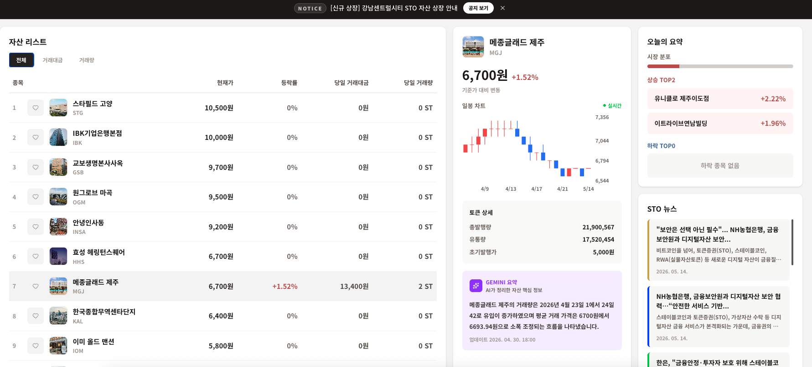
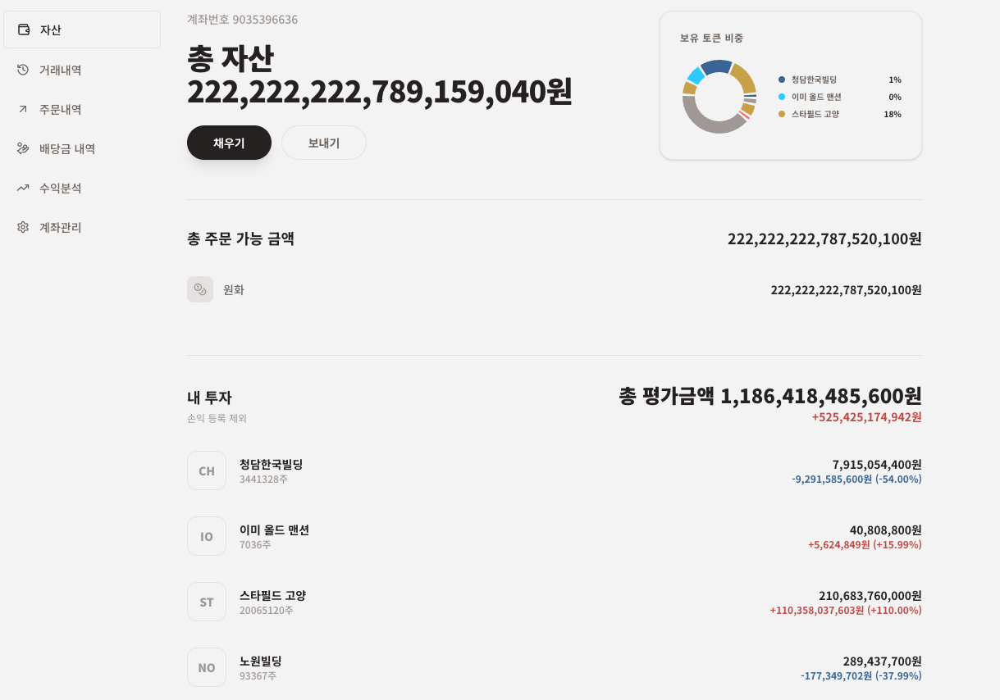
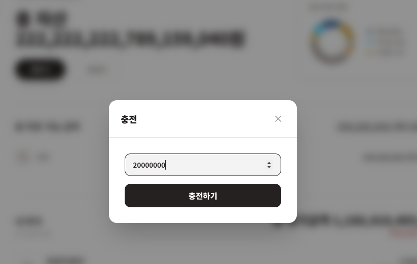
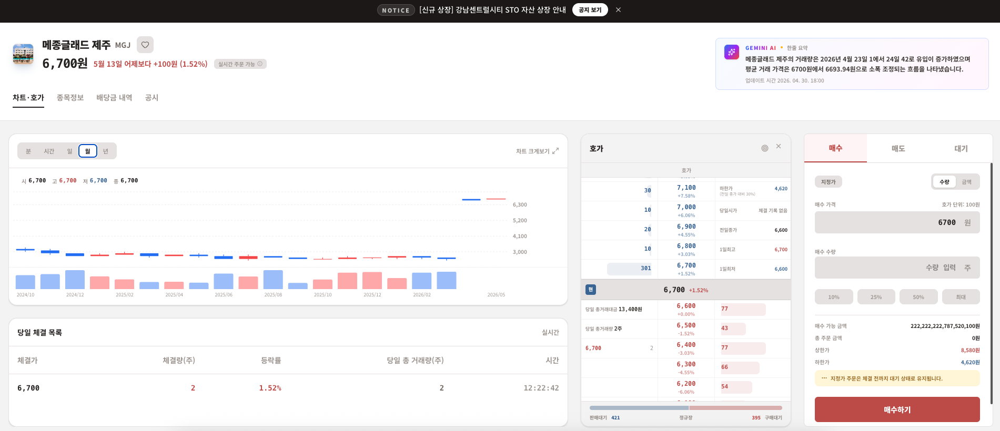
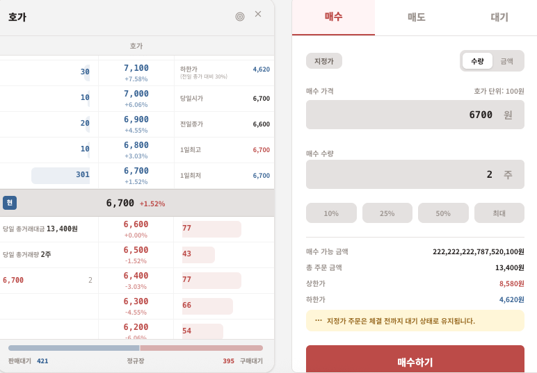
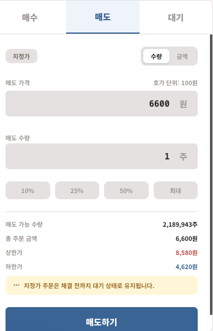
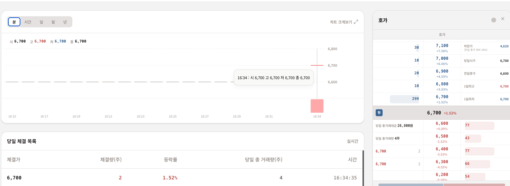
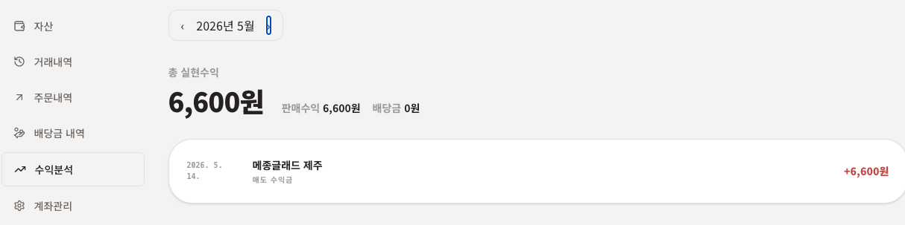
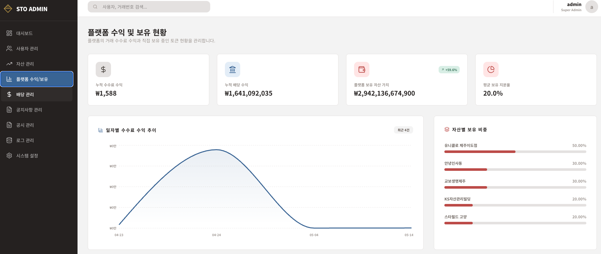

# TRIPTON

**STO 부동산 토큰 증권 금융 프로젝트**

해당 파일은 기능 서술에 초점을 두고 있습니다. 기술적 의사결정 등과 같은 부분은 <a href="https://nippyclouding.github.io/project.html">포트폴리오</a>에서 확인할 수 있습니다.

사용자는 부동산 기반 STO 토큰을 조회하고, 호가 주문을 통해 매수/매도 거래를 진행할 수 있습니다. 
체결 결과는 실시간 호가창, 체결 내역, 알람으로 반영되며, 매수/매도를 통한 정산 및 환전 기능을 제공합니다.

본 프로젝트는 교육용 시뮬레이션 프로젝트이며, 실제 투자 권유 또는 실제 금융 거래 서비스를 목적으로 하지 않습니다.

---

---

### 개발 과정 & 사용 기술

**개발 기간**
- 2개월 (2026.03.~2026.04.)
- 신한 SW 금융 아카데미 프로젝트 우수상

**개발 인원**
- 5명 (프론트엔드 2명, 백엔드 3명)

**개발 환경**
- **Language & DB**: Java 21, PostgreSQL
- **Backend**: Spring Boot 3 with JPA (Spring Data JPA, QueryDSL)
- **Frontend**: React 19, Vite (CSR)
- **Auth**: JWT Tokens
- **Real-Time**: STOMP over SockJS, Redis Pub/Sub
- **Blockchain**: Solidity, Web3j, ERC-20 기반 STO Token Contract
- **Infrastructure**: Docker, Nginx, Redis
    - Main Server Container
    - Match Server Container
    - Batch Server Container
    - Postgres Container
    - Nginx Container
    - Redis Container
- **신한 DS 서버 내부망 배포 (https://sto.shinhanacademy.co.kr/)**

---

### 1. 주요 기능

#### **금액 충전**
사용자는 로그인 후 STO 토큰을 구입하기 위한 예수금을 충전할 수 있습니다. (외부 결제 API 없이 시뮬레이션 방식으로 구현)

#### **STO 상세 페이지 조회**
사용자는 거래하고 싶은 STO 항목을 선택해서 조회할 수 있습니다.
상세 페이지 접속 시 
- REST 조회 : STO 토큰 자산 이름, 전날 종가, 캔들 차트 과거 데이터, 금일 접속 직전까지의 체결 내역
- Match 서버 스냅샷 조회 : 현재 호가 데이터
- 메모리 스냅샷 조회 : 금일 진행 중인 캔들 데이터
- 상세 페이지 접속 이후 실시간 반영 : 주문 체결 내역, 캔들 차트, 호가창, 미체결 주문 상태

#### **호가 - 매수, 매도**
사용자는 구매하고 싶은 토큰을 선택하여 매수 호가를 넣을 수 있습니다. 매도 호가는 토큰을 보유하고 있을 때만 가능합니다.
매수 또는 매도 호가를 넣을 경우 main 서버에서 계좌 비밀번호, 호가 단위, 상/하한가, 예수금 및 보유 수량을 검증한 뒤 match 서버로 호가 요청이 전달됩니다.

#### **주문 체결**
match 서버의 메모리 오더북에서 주문이 체결되면 Redis Pub/Sub를 통해 체결 내역과 호가창이 실시간으로 갱신됩니다.
main 서버는 체결 결과를 바탕으로 예수금, 보유 토큰, 거래 내역, 수수료, 알람을 반영하며, 마이페이지에서 체결 내역을 확인할 수 있습니다.

#### **매수/매도를 통한 정산 및 환전**
사용자는 STO 토큰 매수/매도를 통해 보유 자산을 변경할 수 있으며, 매도 체결 후 정산된 예수금을 환전할 수 있습니다.
거래 체결 정보는 블록체인 배치를 통해 STO 토큰 컨트랙트의 거래 기록 이벤트로 저장됩니다.

#### **관리자 페이지**
관리자는 자산 등록 및 수정, 토큰 상태 관리, 회원 활성/비활성 관리, 플랫폼 수익 조회, 거래 로그 및 시스템 로그 조회를 할 수 있습니다.
또한 실시간 정산 대시보드에서 오프체인 체결 이후 온체인 기록 상태를 확인할 수 있습니다.

---

### 2. 시연

STO 프로젝트의 주요 화면 흐름과 기능 동작을 영상으로 확인할 수 있습니다.

